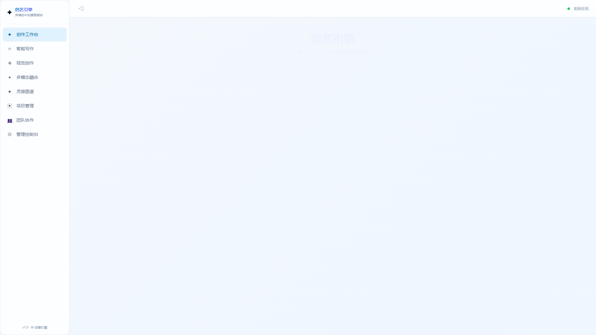
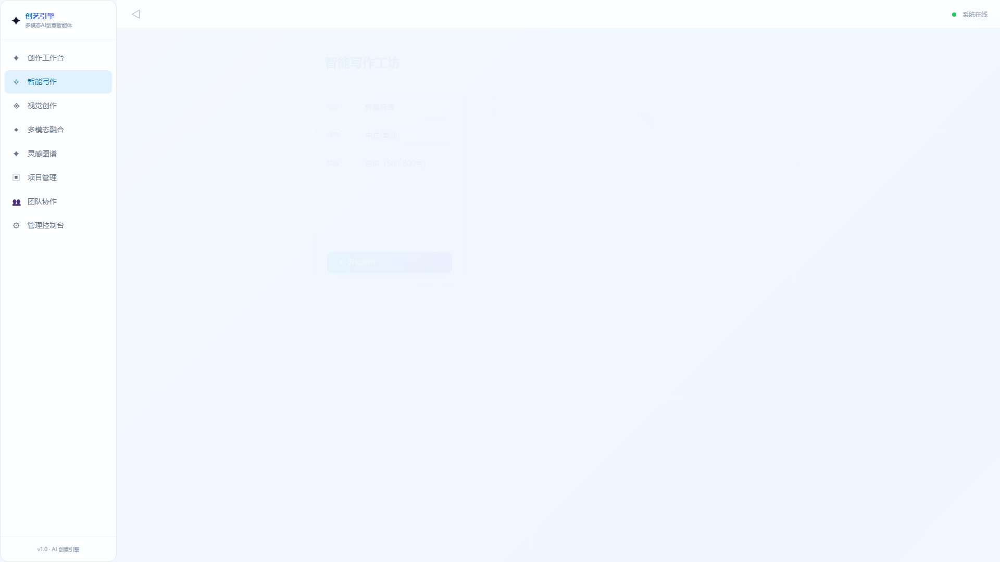
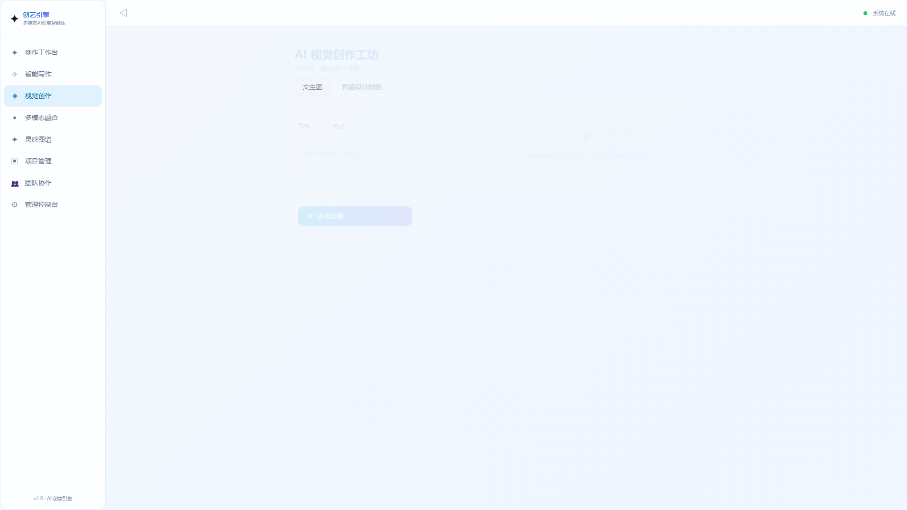
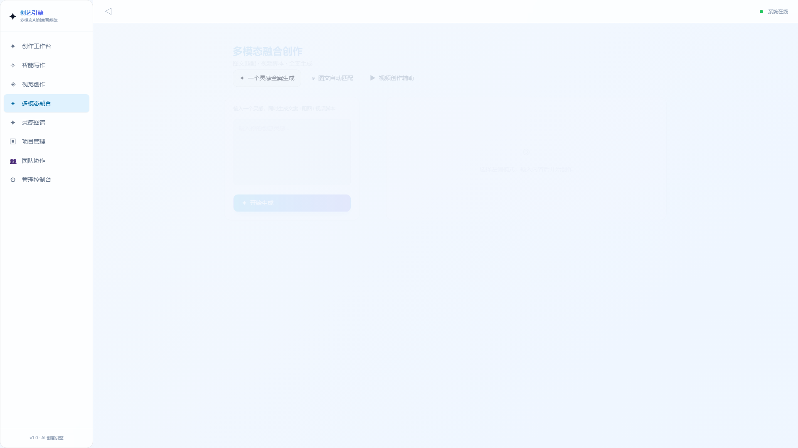
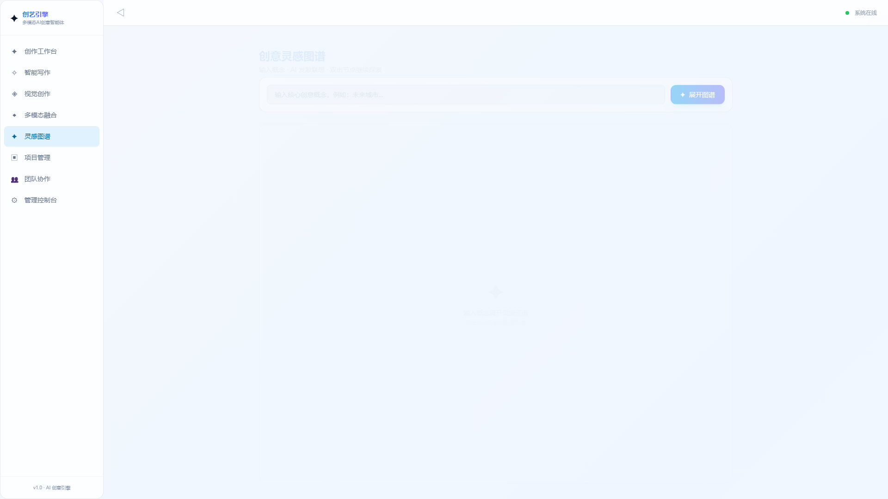
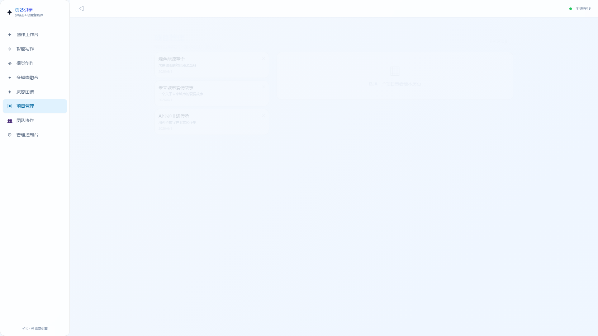
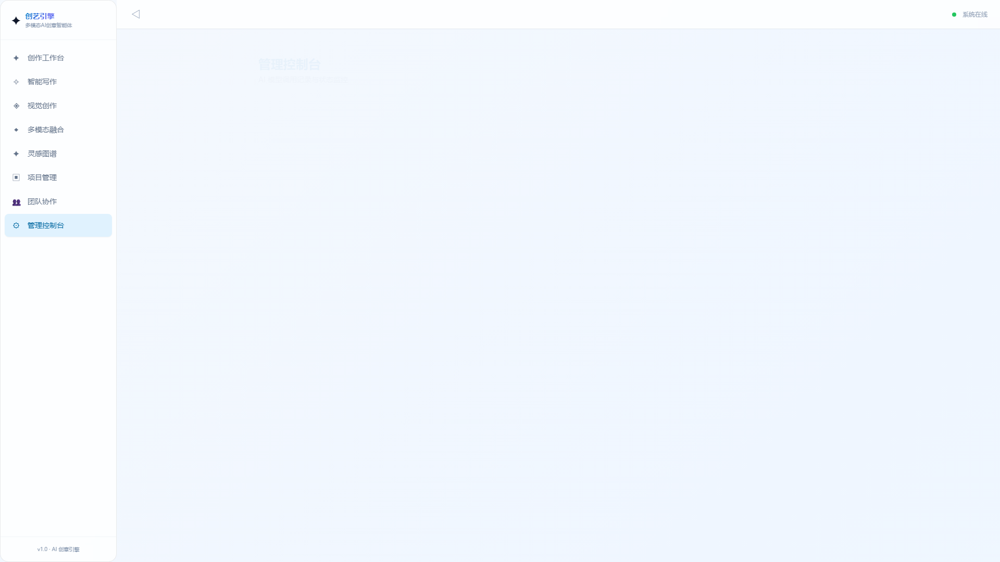

<div align="center">
  <br/>
  <h1>✦ 创艺引擎</h1>
  <p><strong>多模态 AI 创意生成智能体</strong></p>
  <p>一个灵感，全案生成</p>
  <br/>
</div>

<p align="center">
  
  
  
  
  
  
  
</p>

**创艺引擎** 是一款全链路 AI 创意生成平台，深度融合大语言模型与扩散模型技术，让创作者通过自然语言对话即可一站式完成文档撰写、图像生成、设计排版、视频脚本创作等多元创意任务。

> 参赛项目：AI 智能体创新大赛  
> 研发单位：山东职业学院 · 2026年6月

---

## 功能总览

### 创作工作台
灵感输入 → 一键全案生成（文档+配图+视频脚本），支持流式 SSE 实时输出



### 智能写作工坊
6 种文体（新闻报道/营销文案/故事小说/剧本脚本/学术论文/社交媒体）+ 扩写/缩写/风格迁移/翻译



### AI 视觉创作工坊
文生图（7 种风格）+ 智能设计排版（4 种模板），接入通义万相 (`wanx2.1-t2i-turbo`)



### 多模态融合创作
图文自动匹配 / 视频脚本生成 / 全案管线下钻



### 创意灵感图谱
可视化知识图谱（vis-network）+ AI 发散联想 + 双击探索



### 项目管理
项目 CRUD + 版本历史 + 版本对比 + 评论讨论



### 团队协作
成员管理 + 项目评论 + 讨论流


### 管理后台
AI 调用日志监控 + 系统状态看板



---

## 技术架构

```
┌──────────────────────────────────────────┐
│            Frontend (React 19)             │
│  TypeScript · Vite 6 · Tailwind CSS        │
│  Framer Motion · zustand · vis-network     │
│  react-router-dom v7 · 流式 SSE 渲染       │
└─────────────────┬────────────────────────┘
                  │ REST API / SSE
                  ▼
┌──────────────────────────────────────────┐
│          Backend (FastAPI + Python)        │
│  7 个 API 路由模块 · SQLAlchemy ORM        │
│  异步 SQLite · 流式 SSE 端点               │
│  AI 日志记录 · 数据库版本管理               │
└─────────────────┬────────────────────────┘
                  │ DashScope SDK
                  ▼
┌──────────────────────────────────────────┐
│          AI Engine (阿里云 DashScope)       │
│  ┌──────────┐ ┌──────────┐ ┌──────────┐  │
│  │ 通义千问  │ │ 通义万相  │ │ Qwen-VL  │  │
│  │qwen-plus │ │wanx2.1   │ │vl-plus   │  │
│  │文本生成   │ │ 文生图    │ │ 图片理解  │  │
│  └──────────┘ └──────────┘ └──────────┘  │
└──────────────────────────────────────────┘
```

### 前端技术栈

| 技术 | 用途 |
|------|------|
| **React 19** + TypeScript | UI 框架 |
| **Vite 6** | 构建工具 |
| **Tailwind CSS 3** | 样式系统 |
| **Framer Motion** | 页面动画与过渡 |
| **zustand** | 轻量状态管理 |
| **vis-network** | 灵感图谱可视化 |
| **react-router-dom v7** | 路由（8 个功能页面） |
| **react-markdown** | 文档渲染 |

### 后端技术栈

| 技术 | 用途 |
|------|------|
| **Python FastAPI** | REST API + SSE 流式端点 |
| **SQLAlchemy 2.0** (async) | ORM |
| **SQLite** (aiosqlite) | 数据库 |
| **dashscope SDK** | 阿里云 AI 服务 |
| **pydantic** | 请求/响应校验 |

---

## AI 能力

### 文本生成 — 通义千问 (`qwen-plus`)
- 6 种文体专业写作 + 语气/篇幅控制
- 流式 SSE 实时输出（打字机效果）
- 扩写 / 缩写 / 风格迁移 / 多语言翻译

### 图生生成 — 通义万相 (`wanx2.1-t2i-turbo`)
- 7 种风格：国风 / 赛博朋克 / 水彩 / 油画 / 3D渲染 / 扁平插画
- 智能设计排版：海报 / 封面图 / 社交媒体配图 / PPT背景

### 多模态理解 — Qwen-VL (`qwen-vl-plus`)
- 图片内容理解与描述
- 图文自动匹配

### 全链路创作流程
```
灵感输入 → AI 文档生成(流式) → 配图方案(文生图) → 视频脚本(流式) → 全案导出
```

---

## 快速开始

### 前置要求
- Node.js >= 18
- Python >= 3.10
- 阿里云 DashScope API Key（[申请地址](https://dashscope.aliyun.com)）

### 1. 启动后端

```bash
cd backend
pip install -r requirements.txt

# 配置 API Key（编辑 .env 文件）
# DASHSCOPE_API_KEY=your_key_here

uvicorn app.main:app --reload --port 8000
```

API 文档自动生成：http://localhost:8000/docs


### 2. 启动前端

```bash
cd frontend
npm install
npm run dev
```

访问 http://localhost:5173

### 3. 使用说明
- 无需 API Key 时系统使用模拟数据（内嵌 SVG 占位图）展示完整功能
- 配置 API Key 后自动切换为真实 AI 生成

---

## 项目结构

```
创艺引擎/
├── frontend/                      # React + TypeScript 前端
│   ├── src/
│   │   ├── pages/                 # 8 个功能页面
│   │   │   ├── Dashboard.tsx      # 创作工作台（流式全案生成）
│   │   │   ├── WritingWorkshop.tsx# 智能写作工坊
│   │   │   ├── VisualWorkshop.tsx # AI视觉创作工坊
│   │   │   ├── FusionCreation.tsx # 多模态融合创作
│   │   │   ├── InspirationGraph.tsx# 创意灵感图谱
│   │   │   ├── Projects.tsx       # 项目管理
│   │   │   ├── Collaboration.tsx  # 团队协作
│   │   │   └── AdminConsole.tsx   # 管理后台
│   │   ├── api/                   # API 调用封装
│   │   ├── store/                 # zustand 状态管理
│   │   └── components/            # 公共组件
│   └── ...
├── backend/                       # Python FastAPI 后端
│   ├── app/
│   │   ├── api/                   # 7 个 REST API 路由模块
│   │   ├── services/              # 业务逻辑层（AI 调用封装）
│   │   ├── models/                # 数据模型
│   │   ├── db/                    # 数据库配置
│   │   └── config.py              # 应用配置
│   └── ...
├── docs/images/                   # 文档截图
├── README.md
└── TECHNICAL_REPORT.md            # 技术架构报告
```

---

## 数据模型

| 模型 | 字段 | 用途 |
|------|------|------|
| **Project** | id, title, description, source_idea, style | 项目管理 |
| **Version** | id, project_id, label, content_type, content | 版本历史 |
| **Image** | id, project_id, prompt, style, image_url | 图像记录 |
| **Comment** | id, project_id, author, content | 协作评论 |
| **AICallLog** | id, call_type, model, success, response_summary | AI 调用日志 |

---

## 开发计划

- [x] 创作工作台（流式全案生成）
- [x] 智能写作工坊（6 种文体 + 智能改寫）
- [x] AI 视觉创作工坊（文生图 + 设计排版）
- [x] 多模态融合创作（图文匹配 + 视频脚本）
- [x] 创意灵感图谱（vis-network 可视化）
- [x] 项目管理（CRUD + 版本控制）
- [x] 团队协作（评论 + 讨论）
- [x] 管理后台（AI 日志监控）
- [ ] 移动端适配优化
- [ ] 用户登录认证
- [ ] 多供应商 AI 模型切换
- [ ] 云端部署

---

<p align="center">
  山东职业学院 · 2026
</p>
